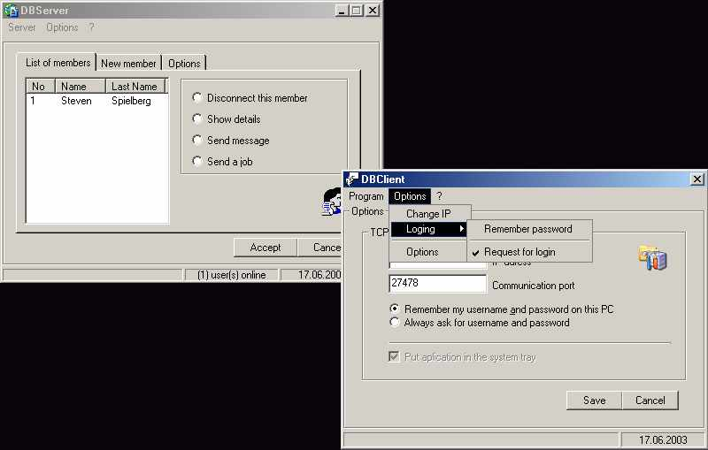



## Client/Server \- Database Access

### Description

This is a Client - Server aplication using database. Server is connected with database. Client aplication can be used for sending messages to other registered (added in database) members, creating jobs, ... sending messages to server ... etc.
 
### More Info
 
When you download this and extract it onto your computer and start Server aplication, you may get a message "Database not found" .... just in program options set up location of database and use the program.

             |
---                |---
**Submitted On**   |2003-06-25 11:02:04
**By**             |[Michael Dean](https://github.com/Planet-Source-Code/PSCIndex/blob/master/ByAuthor/michael-dean.md)
**Level**          |Advanced
**User Rating**    |4.4 (22 globes from 5 users)
**Compatibility**  |VB 6\.0
**Category**       |[Internet/ HTML](https://github.com/Planet-Source-Code/PSCIndex/blob/master/ByCategory/internet-html__1-34.md)
**World**          |[Visual Basic](https://github.com/Planet-Source-Code/PSCIndex/blob/master/ByWorld/visual-basic.md)
**Archive File**   |[Client\_Ser1605706252003\.zip](https://github.com/Planet-Source-Code/michael-dean-client-server-database-access__1-46433/archive/master.zip)

